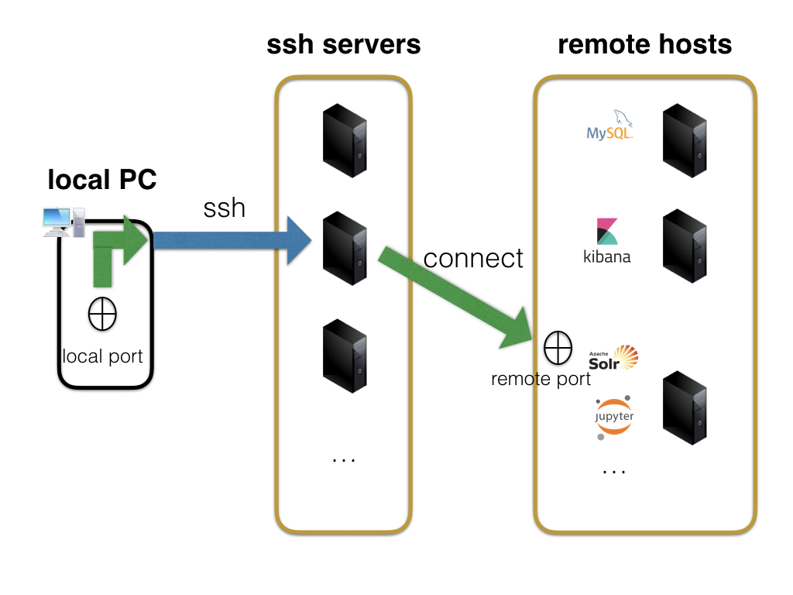

.. image:: https://travis-ci.org/takahi-i/pfm.png?branch=master
   :alt: Build status
   :target: https://travis-ci.org/takahi-i/pfm

=====================================================
pfm -- a ssh port forward manager for data scientists
=====================================================

Data scientists launch a Jupyter Notebook servers to tackle each machine learning task.
Usually local computers are not enough to handle multiple machine learning tasks.
And therefore data scientists do their experiments in servers launched in remote hosts such as EC2 instances.

To connect Jupyter Notebook servers in remote hosts, we use ssh port forwarding.
Port forwarding is useful since we do not consume resources in local PC.

Unfortunately, when connecting servers in multiple remote hosts and ports numbers, we easily forget
the port number or assign the local port number which is used in another task. Especially when there are multiple remote
hosts and ssh servers as the following image, understanding the combinations of remote hosts and local ports are difficult.

pfm manages the remote hosts and port numbers used in port forwarding. Users understand which local
ports are used and which ports are not. Once users register the port forwarding information, pfm generates
ssh parameters any time specifying the task name.

Install
=======

We can install pfm with pip.

::

    pip install pfm

Usage
=====

Register settings of ssh port forwarding
-----------------------------------------

:code:`pfm add` registers port forward settings.

Register settings with options
~~~~~~~~~~~~~~~~~~~~~~~~~~~~~~~~

The following is a sample of adding port forward settings with command line options.

::

    $ pfm add -n image-classification --local-port 9999 --remote-port 8888 --ssh-server myml.aws.com --remote-host localhost

:code:`pfm add` provides the following options.

::

    Usage: pfm add [OPTIONS]

    add port forwarding target

    Options:
        -n, --name TEXT        name of port fowarding
        --forward-type TEXT    port forwarding type [L (local) or R (remote)]
        --local-port INTEGER   local port
        --remote-port INTEGER  remote host port
        --ssh-server TEXT      server to ssh login
        --server-port INTEGER  server port
        --remote-host TEXT     remote host for port forwarding
        --login-user TEXT      login user of ssh server
        --help                 Show this message and exit.

Note that when local port number  (:code:`--local-port`)  is not specified, :code:`pfm add` automatically assigns the local port not to collide to other port forward settings.

Register settings with a argument
~~~~~~~~~~~~~~~~~~~~~~~~~~~~~~~~~~

If you think adding many options are tedious, :code:`pfm add` also provides argument style of registration.

The following is a sample of registration which forwards port 8888 in takahi-i-ml.aws.com to port 9999 of localhost with a local port forward setting.

::

    $pfm add -n image-classification "9999:localhost:8888 takahi-i-ml.aws.com"

As we see the above example is simple and just uses :code:`-n` option. Note that default forward type is set to local (L). If you want to set forward type
to remote please specify the type with :code:`--forward_type` parameter.

Generate ssh port forward parameters
-------------------------------------

After the registration of port forward settings with :code:`pfm add` , we can generate ssh parameters with :code:`pfm param`.

::

    $ ssh `pfm param image-classification`

Update port forward settings
----------------------------

After the registration of port forward settings with :code:`pfm add` , we can modify ssh parameters with :code:`pfm update`.
For example, the following command changes the port forwarding type  of `image-classification` setting from local to remote.

::

    $ pfm update image-classification --name image-classification --forward-type R

List registered ssh port forward settings
------------------------------------------

We can see the list of registered port forward settings.

::

    $ pfm list
    +----------------------+------------+------------+--------------------------------+--------------+-----------------+--------------------------------+--------------+
    |         name         |    type    | local_port |          remote_host           | remote_port  |   login_user    |           ssh_server           | server_port  |
    +======================+============+============+================================+==============+=================+================================+==============+
    | image-processing     | L          | 9999       | localhost                      | 8888         | None            | my-ml-instance.aws.com         |              |
    +----------------------+------------+------------+--------------------------------+--------------+-----------------+--------------------------------+--------------+
    | text-processing      | L          | 7777       | localhost                      | 8888         | None            | my-ml-instance-2.aws.com       |              |
    +----------------------+------------+------------+--------------------------------+--------------+-----------------+--------------------------------+--------------+

Delete registered forwarding setting
------------------------------------

When a port forward settings is not needed, we can remove the setting with :code:`pfm delete` command

::

    $ pfm delete image-process

License
=======

* Free software: MIT license

Contribution
=============

We are welcome any contribution. For details please see `CONTRIBUTING.rst <https://github.com/takahi-i/pfm/blob/master/CONTRIBUTING.rst>`_
